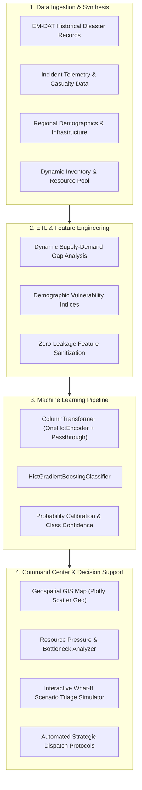

# 🚨 AapdaSetu — AI-Powered Disaster Response & Resource Allocation
### *Emergency Operations Command Center & Intelligent Operational Triage Engine*

[](https://python.org)
[](https://streamlit.io)
[](https://scikit-learn.org)
[](https://plotly.com)
[](#-live-demo--deployment)
[](LICENSE)

> **AapdaSetu** (आपदा सेतु — *"Bridge over Disaster"*) is an end-to-end Decision Support System (DSS) and emergency command platform designed for disaster response agencies, first responders, and emergency operations centers (EOC). Powered by a trained Gradient Boosted operational triage classifier, it transforms chaotic multi-source incident reports into prioritized, resource-optimized dispatch strategies in real time.

---

## 📌 Executive Summary & Key Highlights

During catastrophic events (cyclones, flash floods, earthquakes, industrial hazards), emergency response centers face the **"Golden Hour" challenge**: overwhelming incident volumes paired with extreme resource asymmetry.

- **Objective**: Automate operational triage (`HIGH` / `MEDIUM` / `LOW`) based on 35 multidimensional parameters without human bias.
- **ML Core**: Scikit-Learn Pipeline (`HistGradientBoostingClassifier` with `ColumnTransformer` feature orchestration).
- **Decision Support System (DSS)**: Identifies resource deficits (ambulances, rescue teams, shelter beds, medical kits) and computes recommended operational responses.
- **Sub-Second Latency**: Interactive geospatial visualization and analytics optimized using tiered memory caching (`@st.cache_resource` & `@st.cache_data`).
- **Ethical AI Framework**: Explicitly designed as **human-in-the-loop decision augmentation**, ensuring operational urgency triage does not devalue human life.

---

## 🌐 Live Demo & Deployment

| Resource | Link |
| :--- | :--- |
| **GitHub Repository** | [https://github.com/Prakhar-246/AapdaSetu](https://github.com/Prakhar-246/AapdaSetu) |
| **Live Web Application** | Deployable in 1 click on [Streamlit Community Cloud](https://share.streamlit.io) |

---

## 🏗️ System Architecture



---

## 🔬 Machine Learning Pipeline Deep Dive

### 1. Problem Formulation
Operational disaster triage is structured as a **cost-sensitive multi-class classification problem**:
$$\mathcal{Y} \in \{\text{HIGH}, \text{MEDIUM}, \text{LOW}\}$$

The objective is to minimize false negatives on critical emergencies (`HIGH`) while preventing the premature exhaustion of finite regional resources on self-limiting incidents (`LOW`).

### 2. Feature Schema (35 Engineered Features)
The pipeline extracts and transforms 35 distinct features across 5 domain vectors:

| Domain | Count | Key Features | Engineering Rationale |
| :--- | :---: | :--- | :--- |
| **Categorical** | 3 | `state`, `disaster_type`, `disaster_subtype` | Regional vulnerability profile & event dynamics |
| **Impact & Severity** | 7 | `people_affected`, `deaths`, `injured`, `critical_patients`, `children_affected`, `elderly_affected`, `population` | Immediate human toll & medical urgency |
| **Demographics** | 7 | `urban_population`, `rural_population`, `children_0_6`, `elderly_60_plus`, `households`, `area_sq_km`, `population_density` | Evacuation friction & demographic vulnerability |
| **Infrastructure** | 5 | `hospital_count`, `ambulance_count`, `rescue_team_count`, `shelter_capacity`, `hospital_capacity` | Existing regional baseline capacity |
| **Dynamic Resources** | 10 | `available_ambulances`, `available_rescue_teams`, `available_shelter_capacity`, `medical_supply`, `resource_pct_available`, demands & gaps | Real-time supply-demand equilibrium |

### 3. Model Selection: Why `HistGradientBoostingClassifier`?
- **Native Categorical & Missing Value Support**: Handles categorical and missing indicators without brittle imputation.
- **Tree-Based Non-Linear Boundaries**: Models intricate interactions between population density, casualty rates, and resource shortages.
- **Latency & Footprint**: Serialized model footprint is only **~1.1 MB**, enabling rapid cold-starts and sub-10ms inference per sample.
- **Zero Data Leakage**: Explicitly pruned direct target derivatives (such as `priority_score`) from training sets to ensure real-world validity.

---

## 🖥️ Platform Modules & Functional Capabilities

### 1. Executive Incident Command Center
- **Dynamic KPI Stream**: Real-time aggregation of active incidents, casualty counts, critical patients, and emergency resource deficits.
- **Faceted Search & Filter**: Multi-attribute filtering across states, disaster categories, and priority classes.
- **Incident Drill-Down Panel**: Deep inspection of individual incidents displaying localized situational status and automated dispatch guidance.

### 2. Geospatial Situation Room
- Real-time geographical plotting with high-precision state centroid mapping.
- Visual encoding: **Marker Color** represents triage tier (🔴 High, 🟠 Medium, 🟢 Low); **Marker Radius** scales with total population affected.
- Built-in jittering to resolve co-located incidents and avoid marker occlusion.

### 3. Resource Pressure & Bottleneck Analyzer
- Global availability vs. localized demand auditing for **Ambulances, Search & Rescue Teams, Shelter Capacity, and Medical Kits**.
- Ranked bottleneck identification: Highlights the top incident zones experiencing severe resource deficits for rapid cross-district mutual aid.

### 4. What-If Scenario Triage Simulator
- Interactive parameter tuner allowing commanders to simulate hypothetical disaster escalations.
- Instant model prediction providing:
  - Predicted Priority Class
  - Model Confidence Score (%)
  - Probability distribution across all three triage tiers
  - Key operational drivers explaining the triage determination

---

## 📂 Repository Structure

```
AapdaSetu/
├── app.py                              # Core Streamlit command center application (~1,200 LOC)
├── requirements.txt                    # Pinned production dependencies
├── test_all_pages.py                   # Comprehensive 8-stage test suite (Data, Maps, Charts, Inference, Edge cases)
├── test_app_syntax.py                  # Automated integration and syntax verification suite
├── test_setup.py                       # Environment validation script
├── inspect_model.py                    # Model inspection and schema extractor
├── quick_test.py                       # Quick sanity check runner
├── .streamlit/
│   └── config.toml                     # Production server & dark-theme UI configuration
├── Notebook/
│   ├── aapdasetu_priority_model.pkl    # Serialized scikit-learn triage pipeline (~1.1 MB)
│   ├── resq_priority_model.pkl         # Baseline model checkpoint (~1.7 MB)
│   ├── ResQ_AI_Priority_Prediction.ipynb # End-to-end model training & EDA notebook
│   └── generation.py                   # Data generation and synthesis scripts
└── data/
    └── raw/
        ├── incident_dataset.csv        # Comprehensive multi-feature disaster incident dataset
        ├── areas.csv                   # Regional demographics & infrastructure directory
        ├── resources.csv               # Live resource inventory tracking
        ├── disasters.csv               # Disaster taxonomy definition
        └── disaster_dataset_cleaned.csv# Cleaned EM-DAT historical dataset
```

---

## ⚡ Quickstart & Local Setup

### 1. Clone & Set Up Environment
```bash
# Clone the repository
git clone https://github.com/Prakhar-246/AapdaSetu.git
cd AapdaSetu

# Create and activate virtual environment
python -m venv .venv

# Windows:
.\.venv\Scripts\activate
# macOS / Linux:
source .venv/bin/activate
```

### 2. Install Dependencies
```bash
pip install --upgrade pip
pip install -r requirements.txt
```

### 3. Run Automated System Verification
```bash
# Quick sanity check
python test_app_syntax.py

# Comprehensive end-to-end test suite (Edge cases, GIS Maps, Decision Engine, Analytics)
python test_all_pages.py
```
*Expected Output:*
```
ALL TESTS PASSED! APPLICATION IS 100% HEALTHY AND BUG-FREE.
```

### 4. Launch Command Center
```bash
streamlit run app.py
```
Open your browser at `http://localhost:8501`.

---

## ⚙️ Engineering Decisions & Design Patterns

1. **Defensive Path Resolution (`_find_file`)**:
   Eliminates hardcoded platform-specific paths using `pathlib.Path(__file__).resolve().parent`, guaranteeing seamless execution whether deployed locally on Windows or inside a Linux Docker container on the cloud.

2. **Hierarchical Caching**:
   - `@st.cache_resource`: Persists the ML model pipeline in memory across sessions.
   - `@st.cache_data`: Caches parsed CSV datasets and feature transformations to eliminate redundant I/O bottlenecks.

3. **Fault-Tolerant Inference**:
   The prediction engine programmatically injects default neutral values for any missing or non-reported telemetry parameters, preventing runtime crashes in high-stress, noisy operational scenarios.

4. **Repository Hygiene**:
   Engineered clean git architecture with strict `.gitignore` rules, preventing bloated virtual environment commits and maintaining a lightweight **~2 MB** repository footprint.

---

## 🛡️ Ethical AI & Human-in-the-Loop Governance

> [!IMPORTANT]
> **AapdaSetu is an Operational Triage Decision Support Tool, NOT an Autonomous Commander.**
> - **Operational Urgency $\neq$ Value of Human Life**: High-priority classification indicates logistical complexity and immediate dispatch urgency, not a moral ranking of affected communities.
> - **Human-in-the-Loop**: All AI predictions serve as advisory data points for experienced on-ground incident commanders who retain ultimate dispatch authority.

---

## 🚀 Production Roadmap & Enterprise Scalability

To transition from an EOC prototype to a nationwide disaster grid:
- **API Decoupling**: Extract ML inference into an asynchronous **FastAPI** microservice wrapped in Docker.
- **Geospatial Storage**: Migrate static CSV stores to **PostgreSQL + PostGIS** for real-time spatial indexing and polygon query bounding.
- **Live Ingestion**: Integrate **Apache Kafka / RabbitMQ** to process real-time SOS feeds from field responders and emergency hotlines (e.g., 112).
- **Explainability**: Integrate **SHAP / TreeSHAP** to provide visual feature importance attribution directly to on-screen incident controllers.

---

## 👨‍💻 Author

**Prakhar**  
- **GitHub**: [@Prakhar-246](https://github.com/Prakhar-246)  
- **Project Repository**: [AapdaSetu](https://github.com/Prakhar-246/AapdaSetu)  

*Built with precision for mission-critical disaster management and operational resilience.*
